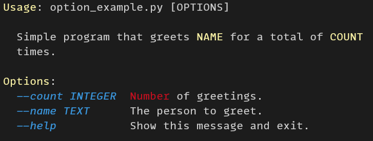

<div id="top"></div>
<!-- PROJECT SHIELDS -->
[![Forks][forks-shield]][forks-url]
[![Stargazers][stars-shield]][stars-url]
[![Issues][issues-shield]][issues-url]
[![MIT License][license-shield]][license-url]


<!-- PROJECT LOGO -->
<br />
<div align="center">
  <a href="https://github.com/daylinmorgan/click-rich-help">
    
  </a>

<h2 align="center">click-rich-help</h2>

  <p align="center">
    make a beautiful click app with rich
  </p>
</div>


<!-- TABLE OF CONTENTS -->
<details>
  <summary>Table of Contents</summary>
  <ol>
    <li>
      <a href="#about-the-project">About The Project</a>
      <ul>
        <li><a href="#built-with">Built With</a></li>
      </ul>
    </li>
    <li>
      <a href="#getting-started">Getting Started</a>
      <ul>
        <li><a href="#prerequisites">Prerequisites</a></li>
        <li><a href="#installation">Installation</a></li>
      </ul>
    </li>
    <li><a href="#usage">Usage</a></li>
    <li><a href="#contributing">Contributing</a></li>
    <li><a href="#license">License</a></li>
    <li><a href="#acknowledgments">Acknowledgments</a></li>
  </ol>
</details>


<!-- ABOUT THE PROJECT -->
## About The Project


Click the screenshot below to see it in action!

<a href="https://asciinema.org/a/81psoVhEc6F568fZppb6qKBVb">  </a>


<p align="right">(<a href="#top">back to top</a>)</p>


### Built With

* [click](https://click.palletsprojects.com/en/8.0.x/)
* [rich](https://rich.readthedocs.io/en/latest/)

<p align="right">(<a href="#top">back to top</a>)</p>


<!-- GETTING STARTED -->
## Getting Started


### Installation

``` bash
pip install click-rich-help
```

future releases should allow install via conda-forge
```bash
conda install -c conda-forge click-rich-help
```

<p align="right">(<a href="#top">back to top</a>)</p>

<!-- USAGE EXAMPLES -->
## Usage

The syntax for usage is not much different than [click-help-colors](https://github.com/click-contrib/click-help-colors) on which this project it based.

You apply the class to `click` groups or commands like so:

```python
@click.group(
    cls=HelpStylesGroup,
    headers_style="yellow bold",
    options_style="cyan italic",
    metavar_style="red bold",
)
def cli():
    pass
```

Note that the general context has changed from help _colors_ to help _styles_.
This was intentionally changed to reflect the addition of other ANSII styles, i.e. bold, italic.

This isn't the only significant change though! Now there is also support for coloring metavars.
If no color is specified than they will default to the color of the options.

In addition any string that would usually be passed to click will be parsed by `rich` to apply the needed colors in styles.

This means you can use rich syntax in `click.option()` decorators as well as in docstrings of commands. For instance, you can have something like below.

```python
import click
from click_rich_help import HelpStylesCommand

@click.command(
    cls=HelpStylesCommand,
    options_style="italic cyan",
    headers_style="bold yellow"
)
@click.option('--count', default=1, help='[red]Number[/red] of greetings.')
@click.option('--name', prompt='Your name',
              help='The person to greet.')
def hello(count, name):
    """Simple program that greets [b yellow]NAME[/b yellow] for a total of [b yellow]COUNT[/b yellow] times."""
    for x in range(count):
        click.echo(f"Hello {name}!")

if __name__ == '__main__':
    hello()
```

If you were to view the `--help` of the above command you should see the below output.




To preview the included example module in your own terminal you can use two methods:

W/o `click-rich-help` and w/ `asciinema`

```bash
asciinema play https://asciinema.org/a/81psoVhEc6F568fZppb6qKBVb
```

W/ `click-rich-help`  and `curl`

```bash
curl -s https://raw.githubusercontent.com/daylinmorgan/click-rich-help/main/scripts/example.sh | bash
```

You can also run it yourself if you have installed `click-rich-help`. Which you should!

```bash
python -m click_rich_help.example -h
```

<p align="right">(<a href="#top">back to top</a>)</p>


<!-- CONTRIBUTING -->
## Contributing

To contribute please utilize `poetry` and `pre-commit`.

optionally manage python installation with `conda`:

```bash
conda create -n rich_dev python=3.7 poetry
```

Then follow the below steps
1. Fork the Project
2. Install the package and dev dependencies w/poetry(`cd click-rich-help; poetry install`)
2. Create your Feature Branch (`git checkout -b feat/AmazingFeature`)
3. Commit your Changes (`git commit -m 'Add some AmazingFeature'`)
4. Push to the Branch (`git push origin feat/AmazingFeature`)
5. Open a Pull Request

<p align="right">(<a href="#top">back to top</a>)</p>


<!-- LICENSE -->
## License

Distributed under the MIT License. See `LICENSE`  for more information.

<p align="right">(<a href="#top">back to top</a>)</p>

## Roadmap

- [x] Integrated example module
- [ ] Implement Type checking
- [ ] Add option to color all help strings
- [ ] CI
	- [ ] test
	- [ ] pypi

<!-- CONTACT -->
## Contact

Daylin Morgan - [@tweetsbydaylin](https://twitter.com/tweetsbydaylin)

Project Link: [https://github.com/daylinmorgan/click-rich-help](https://github.com/daylinmorgan/click-rich-help)


<p align="right">(<a href="#top">back to top</a>)</p>

<!-- ACKNOWLEDGMENTS -->
## Acknowledgments

* [click](https://github.com/pallets/click)
* [rich](https://github.com/willmcgugan/rich)
* [click-help-colors](https://github.com/click-contrib/click-help-colors)

<p align="right">(<a href="#top">back to top</a>)</p>


<!-- MARKDOWN LINKS & IMAGES -->
<!-- https://www.markdownguide.org/basic-syntax/#reference-style-links -->
[contributors-shield]: https://img.shields.io/github/contributors/daylinmorgan/click-rich-help.svg?style=flat
[contributors-url]: https://github.com/daylinmorgan/click-rich-help/graphs/contributors
[forks-shield]: https://img.shields.io/github/forks/daylinmorgan/click-rich-help.svg?style=flat
[forks-url]: https://github.com/daylinmorgan/click-rich-help/network/members
[stars-shield]: https://img.shields.io/github/stars/daylinmorgan/click-rich-help.svg?style=flat
[stars-url]: https://github.com/daylinmorgan/click-rich-help/stargazers
[issues-shield]: https://img.shields.io/github/issues/daylinmorgan/click-rich-help.svg?style=flat
[issues-url]: https://github.com/daylinmorgan/click-rich-help/issues
[license-shield]: https://img.shields.io/github/license/daylinmorgan/click-rich-help.svg?style=flat
[license-url]: https://github.com/daylinmorgan/click-rich-help/blob/master/LICENSE.txt
